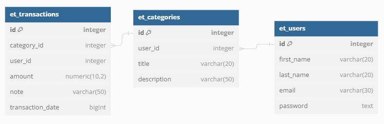
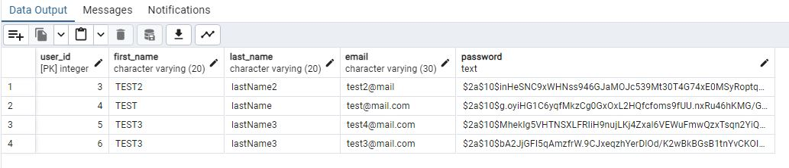
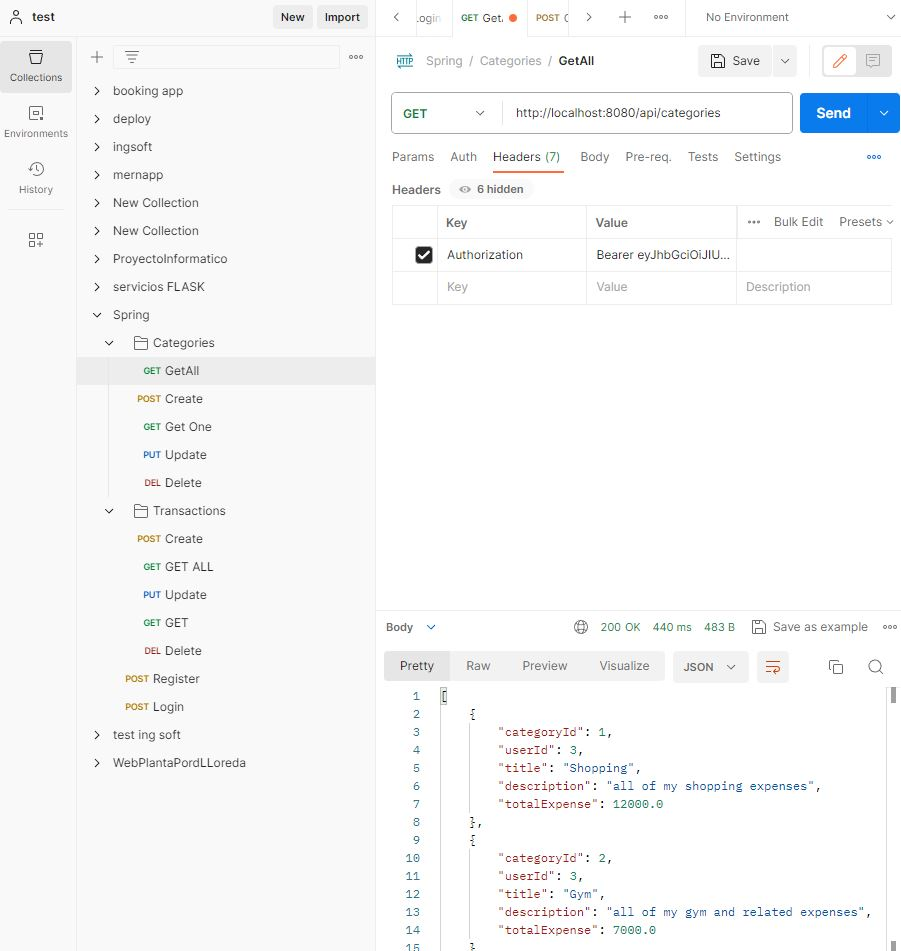

# 🍃 Srping Boot | REST API | Java | Back-end | 

---

This project is a simple rest api made in spring boot, the goal of this project is to be hosted in render to be able to properly consume the apis from a url

---
## ⚒ Tecnologies:

- Java
- Spring Boot
- PostgreSQL (render bd)
- Swagger UI
- JWT (Json Web Token)
- Maven

---

## 💾 Database Diagram

## 💾 Users with encrypted passwords

### test User:

| mail            | password               |
| -------------------|--------------------------|
| test2@mail              |           test123456            |

---

##  Overview
### swagger:

### PostMan:

---

## 💼  [Linkedin](https://www.linkedin.com/in/nicolas-escandon/)